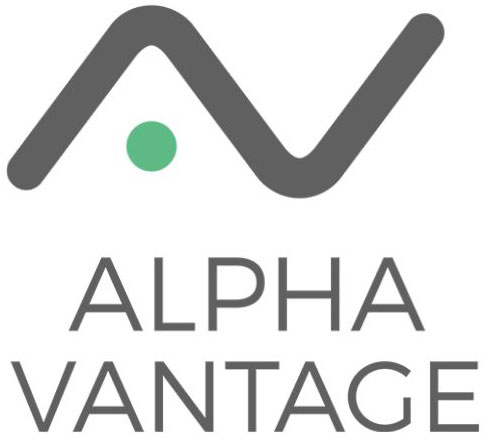

### Hello, I'm Juan Scanlan 👋 :ocean:
### Please visit my personal website: https://juanscanlan.github.io/

I was born in Cozumel, Mexico. The most eastern island off the coast of Mexico.
In 2020, I graduated with Honors from the University of Bristol in Mechanical Engineering. 
Now I develop software and make Machine Leaning models as a hobby.

## Web Development:

### <a href="https://juanscanlan.github.io/watches-website/">⌚ React.js: SPA Watch website with Firebase database</a> | <a href="https://github.com/juanscanlan/watches-website">Repository</a>

## Languages and Tools used:
  
  
  
  
  
  
  
  
  
  
 

 

### <a href="https://omkara-spa.vercel.app/">🧖‍ Next.js: SPA for a Spa and Massage company</a> | <a href="https://github.com/juanscanlan/omkaraSpa">Repository</a>

## Languages and Tools used:
  
  
    
  
  
  
  
 

 

### <a href="https://scubajuan.com/">🤿 ScubaJuan.com</a> | <a href="https://github.com/juanscanlan/scubajuan">Repository</a>

## Languages and Tools used:
  
  
  
  
  
  
  
 

 

### <a href="https://juanscanlan.github.io/Hangman-React/">🧍‍♂️ React.js: Hangman Game</a> | <a href="https://github.com/juanscanlan/Hangman-React">Repository</a>

## Languages and Tools used:
  
  
  
  
  
  
  
  
 

 

### <a href="https://albatrossparasail.com/">🪂 AlbatrossParasail.com</a> | <a href="https://github.com/juanscanlan/AlbatrossParasail">Repository</a>

## Languages and Tools used:
  
  
  
  
  
  
  
 

