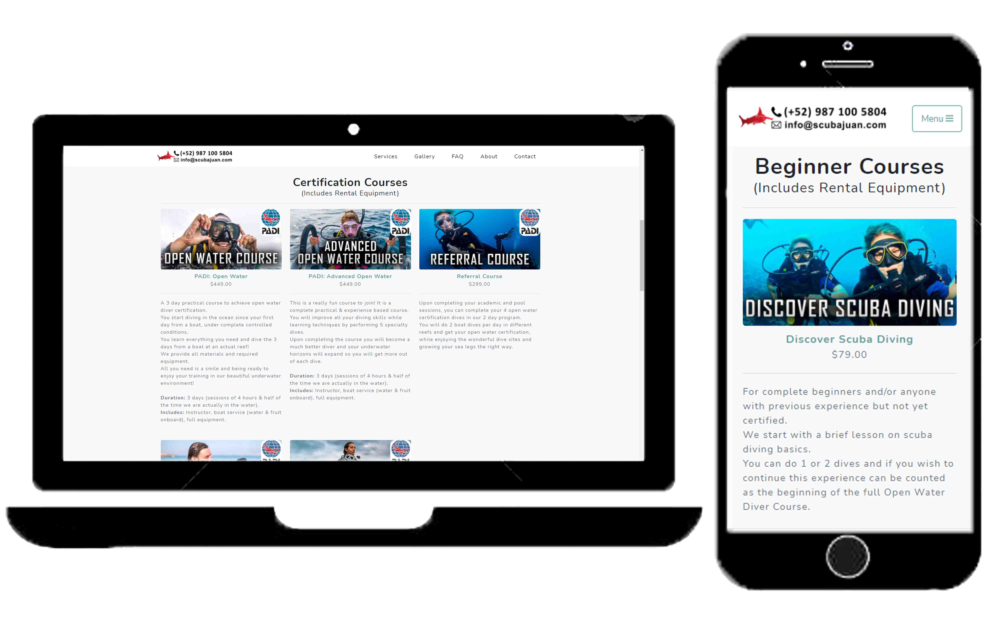
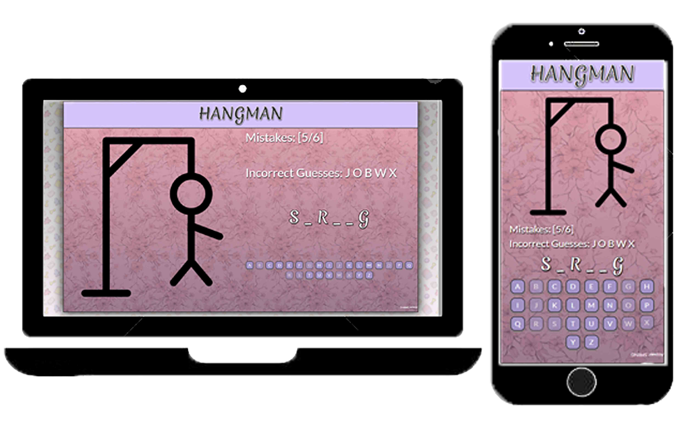

### Hello, I'm Juan Scanlan 👋 :ocean:

I was born in Cozumel, Mexico. The most eastern island off the coast of Mexico.
In 2020, I graduated with Honors from the University of Bristol in Mechanical Engineering. 
Now I develop software and make Machine Leaning models as a hobby.

## Examples of work:

### <a href="https://scubajuan.com/">ScubaJuan.com</a> | <a href="https://github.com/juanscanlan/scubajuan">Repository</a>

## Languages and Tools used:
  
  
  
  
  
  
 

### <a href="https://juanscanlan.github.io/Hangman-React/">Hangman Game in ReactJS</a> | <a href="https://github.com/juanscanlan/Hangman-React">Repository</a>

## Languages and Tools used:
  
  
  
  
  
  
  
  
 

### <a href="https://albatrossparasail.com/">AlbatrossParasail.com</a> | <a href="https://github.com/juanscanlan/AlbatrossParasail">Repository</a>

## Languages and Tools used:
  
  
  
  
  
  
 

